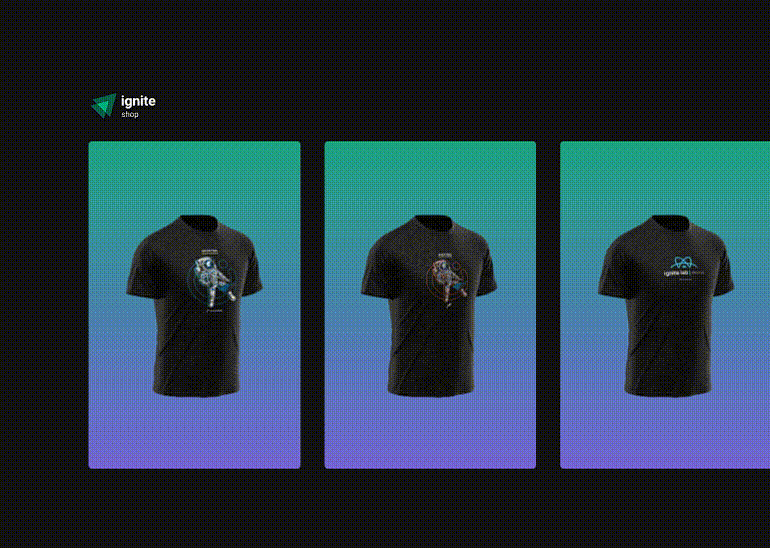

Um e-commerce de camisetas utilizando a Api de pagamentos do Stripe no Next com typescript.

## Rodar o projeto

Recomendo usar a versão do Node 16 ou superior, usei a 16.14.0

```bash
npm i
npm run dev

# or

yarn
yarn dev
```
<hr><br>
<div align="center">
    
</div>

<hr><br>

## Tecnologias

O projeo foi desenvovido com as seguintes tecnologias:

- Next
- Stripe
- Stitches
- React
- Typescript
- Axios
- Keen-slider

---

Feito por Matheus Bezerra, entre em contato pelo Linkedin --> <a href="https://www.linkedin.com/in/matheus-bezerra04/">Matheus-Bezerra04</a> 
<p>Ou entre em contato pelo Numero (11) 97661-1929</p>